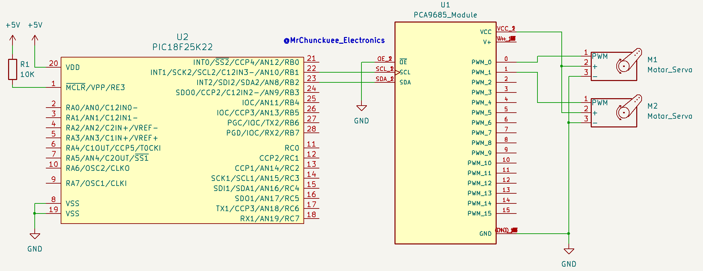

# XC8-PCA9685Module-PWMCtrlServo


A C library designed for **PIC Microcontrollers** to interface with the **PCA9685** 16-channel, 12-bit PWM controller. This library is ideal for projects requiring precise control of multiple Servos via the I2C bus (maybe you can used for LED dimming).

## Features

* **16-Channel Control:** Individually manage up to 16 PWM outputs with a single I2C connection.
* **12-bit Resolution:** Precise control with 4096 steps of PWM duty cycle.
* **Servo Optimized:** Simplified functions to set pulse widths specifically for standard analog and digital servos.
* **Configurable Frequency:** Supports PWM frequencies from 24Hz to 1526Hz.
* **I2C Addressable:** Easily handle multiple PCA9685 modules on the same bus using hardware address pins.

##  Hardware Connection

The PCA9685 requires an I2C interface (SDA/SCL) and an optional Output Enable (OE) pin.

| PCA9685 Pin | Function | PIC18 Connection (Example) |
| :--- | :--- | :--- |
| **VCC** | Logic Power | 3.3V - 5V |
| **V+** | Servo Power | 5V - 6V (External Source) |
| **SDA** | I2C Data | RB0 / SDA Pin |
| **SCL** | I2C Clock | RB1 / SCL Pin |
| **OE** | Output Enable | GND (Always ON) or Digital Pin |
| **GND** | Ground | Common Ground |

Example of connection with a PIC18F25K22:


## Usage Example

This example demonstrates how to initialize the module and set a servo to a specific position.

```c
#include <xc.h>
#include "pca9685.h"

void main(void) {
    // 1. Initialize I2C and System
    SYSTEM_Initialize();
    I2C_Init();
    
    // 2. Initialize PCA9685 (Address 0x40 is default)
    PCA9685_Init(0x40);
    
    // 3. Set PWM Frequency to 50Hz (Standard for Servos)
    PCA9685_SetPWMFreq(50);
    
    while(1) {
        // Set Channel 0 to 1.5ms pulse (Center for most servos)
        PCA9685_SetServoPulse(0, 1500); 
        
        __delay_ms(1000);
        
        // Set Channel 0 to 2.0ms pulse
        PCA9685_SetServoPulse(0, 2000);
        
        __delay_ms(1000);
    }
}
```

## Project Structure
* `src/`: Core library files (`pca9685.c`, `pca9685.h`).
* `examples/`: Ready-to-use project examples for MPLAB X.
* `docs/`: Data-sheets and connection diagrams.
* `LICENSE`: MIT License.
* `CHANGELOG`: History of updates and bug fixes.

## Documentation & Tutorial
For a detailed implementation explanation and step-by-step guide, you can review the following examples:
* [PIC18F25K22 & XC8: Control de servomotores con el modulo PCA9685](https://mrchunckuee.blogspot.com/2025/05/pic18f25k22-xc8-control-de-servomotores.html)
